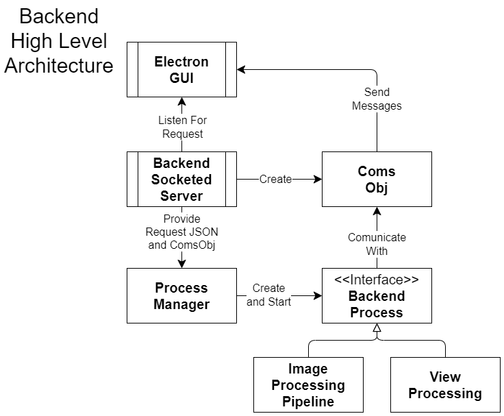
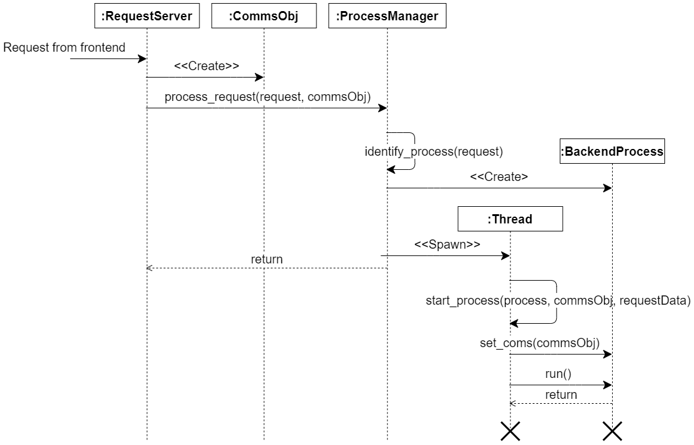

# Archetecture

# Teckstack
The technologies selected to build this application were chosen to help facilitate the need of creating a stand alone application. It was known from the beginning that this project would need to include the ability to bundle everything together and provide the end users with a single downloadable installation package as well as be able to handle the processing of multiple large images simultaneously. For a brief moment, python was a consideration, as everyone on our team was familiar with it, but in the end we knew that we wanted a language that would be better suited to design patterns and the speed of a compiled language. What we settled on for our final tech stack includes the following.

* **Electron:** an open source framework for building cross platform desktop GUI applications. Electron uses web technologies and allows for the front end to be built using javascript, HTML, and CSS. Additionally it provides the means of building a fully packaged installation package.

* **Svelte:** an open source frontend compiler, that compiles HTML into efficient javascript. It provides the means to build a component based reactive front end that can run Electron or a browser.

* **C++:** was chosen as the language to build our backend for the speed we would get from working in a lower level language. Additionally, as an OOP language C++ provides the ability to utilize a number of design patterns that have helped make building the initial features of this application easier and will hopefully aid in building more features in the future.

* **Vcpkg:** an open source C/C++ package management system that aids in managing the third party dependencies this project uses.
CMake, an open source software for automating our backend build system.

# High Level Design
At a high level our application functions much like a web application, due to the tech stack chosen. The user interacts with the UI running in Electron, the [frontend](./FrontendDesign.md) sends requests to the [backend](./BackendDesign.md) which is listening for TCP requests via websockets on a port that is determined at runtime depending on available ports at the time. Upon receiving a request the backend spins up a process to perform the necessary task and sends info back to the front end.
 

*Diagram 5. Shows a high level representation of the relationship between the frontend and backend, as well as some of the important classes involved upon the backend receiving a request.*

*Diagram 6. Shows the sequence of events that occur upon the backend receiving a request.*

