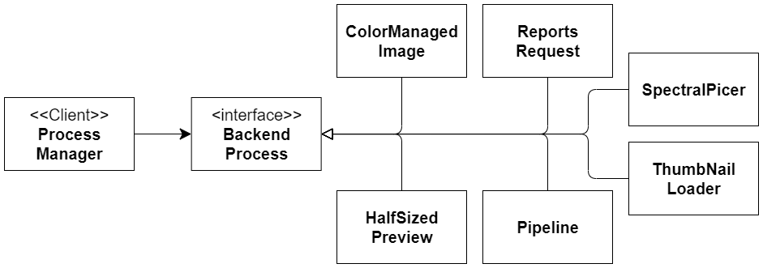
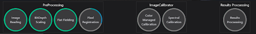
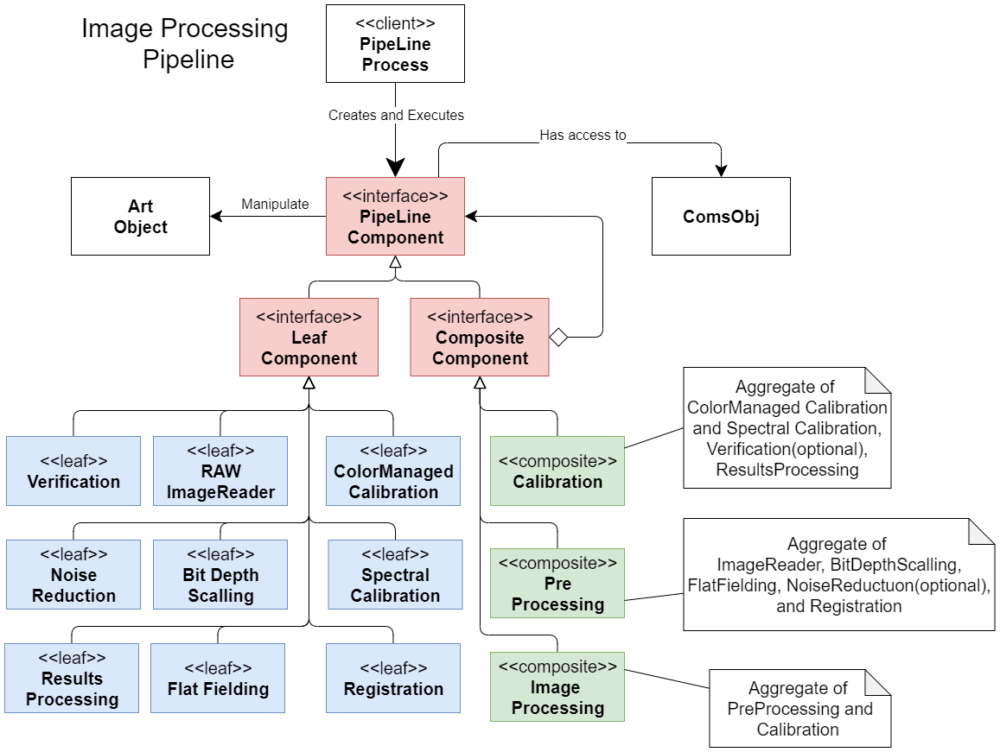
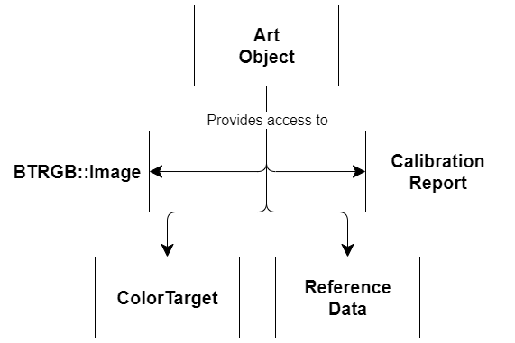
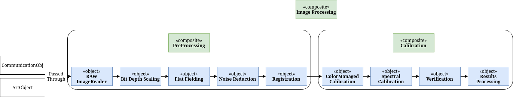

# Backend Design

## ProcessManager
The `ProcessManager` is responsible for parsing the initial JSON request, identifying what is being requested, and spawning a new thread to run the requested process. This subsystem utilizes a structure that closely resembles the **strategy pattern** and allows for easy addition of new processes to the system. Once the process manager has identified the process being requested, a new instance of that process is created. The `ProcessManager` then **spawns a new Thread** to initialize and run the new process. Every process is initialized  by setting both its `CommunicationsObj` and request data JSON. 

*Diagram 7. Shows the relationship between the process manager and all of the BackendProcesses that currently exist in this system.*

## BackendProcessies
For every request that this system supports there exists a specific `BackendProcess` for it. The `BackendProcess` *Interface* provides each concrete Process that inherits from it a default means of containing and interacting with RequestData (specific to each Process in JSON format) and a `CommunicationsObj`(specific to each request). Furthermore, `BackendProcess` declares a virtual(abstract) run method and any class inheriting from it is responsible for defining what it does when run.

**To add any new `BackendProcess`** to this system one must simply follow these steps.
1. Create a class to represent the Process and inherit from the `BackendProcess` Interface
2. Override and define the run method.
3. Add the new Process to the `ProcessManager::identify_process()` method.
   
These steps alone will hook up the new process to automatically contain any request data sent by the front end, have access to a `CommunicationsObj` for sending responses back to the frontend, and be run in a new Thread.

## ImageProcessing
The ImageProcessing subsystem is responsible for processing input images to generate a ColorManaged image output as a .TIFF as well as results data in many different formats. ImageProcessing is represented by the Pipeline BackendProcess, which utilizes the composite pattern to manage all of the various steps used to convert the input images into the output of the pipeline. The composite pattern allows for this pipeline to be constructed dynamically at run time, providing the ability to easily add or remove optional steps each time ImageProcessing is requested. Additionally, by using the composite pattern this system can nest any number of steps inside any other step allowing effortless dynamic progress indicators shown below(Image 1. and Image 2.).

The `ImageProcessingComponent` *Interface* declares two virtual(abstract) methodes, `execute(CommunicationObj*, ArtObject*)`, and `get_component_list()`, that any class inheriting these methods are responsible for defining what happens when it is executed. The execute method contains pointers to a `CommunicationObj`, and an `ArtObject` as parameters so that every Component has access to communications and the current state of the images being processed. Both the `LeafComponent` and `CompositeComponent` classes inherit from `ImageProcessing` and are themselves *Interfaces*, as they pass on the responsibility of defining the execute method to their children. They do however define what is returned by `get_component_list()` so that child classes don't have to.

**To add any new `ImageProcessingComponent`** to this system one must simply follow these steps.
1. Create a class to represent the Component and inherit from either the `LeafComponent` or `CompositeComponent` *Interface*.
2. Provide a constructor that defines a name passed onto the parent class. If inheriting from CompositeComponent take in a vector of `ImageProcessingComponents` and pass them to `init_components()`
3. Override and define the execute method. At the beginning/end of the execute method each Component is **responsible** for sending a progress of 0/1 respectively to the front end to indicate its beginning/ending. It is up to each Component to send additional(if any) progress values(in numeric order) between 0 and 1 throughout their execution.
4. Add the new Component to the `Pipeline::pipeline_setup() `method.
   
These steps alone will hook up the new Component to automatically be included in the pipeline when conditions(if any) are met, execute in the order specified in `Pipeline::pipeline_setup()`, have access to communications and current image data, and update the progress indicator on the front end.

*Image 1. Shows the dynamic progress indicator as seen in our application when no optional pipeline components are included.*

*Image 2. Shows the dynamic progress indicator as seen in our application when optional pipeline components are included.*

*Diagram 8. Shows a high level representation of the ImageProcessing subsystem and all of the Components that currently exist in the pipeline.*

## CalibrationResults
Throughout the image processing pipeline data is collected and stored. This is done via a `CalibrationResults` object, three of which(`GeneralInfo`, `Calibration`, `Verification`) are held within the `ArtObject`. The `CalibrationResults` class store data in unordered_maps, allowing values to be retrieved by providing the key used to store it. The types of values that can be stored include ints, doubles, strings, and cv::Mat ( open cv matrices ). The `CalibrationResults` class is **serializable**, and can dump all data contained within into a json object. The serialization process can be reversed, reconstructing a new `CalibrationResults` object given a json object with results data.

At the end of every image processing pipeline our application generates a number of output files. All output files are placed in a folder located within the user specified output directory. The output folder is labeled “BeyondRGB_<date>_<time> and all output files are tagged with a timestamp to link them together. The types of files output by the application include:

* **Image Output**
  * **ColroManged Image:** the resulting image from the ColorManagedCalibration process is saved as a .TIFF
  * **Spectral Image:** this is a .TIFF containing 6 gray scale images channels each representing the RGB( R1G1B1R2G2B2) channels from the two input art images as they were after PreProcessing.

* **User Readable Output** 
At the end of the image processing pipeline all of the data collected throughout the process is written out to results files. User readable .csv files are generated  using the strategy pattern. For each .csv output file the ResultsProcess Component selects a formatting strategy, then provides it the CalibrationResults and a file output stream. 

* **BTRGB Output** 
Finally, our application outputs a project.btrgb file that contains all information collected throughout the process in a JSON format. Included in this file is a list of all **output** `file names`, and all `CalibrationResults` instances in a serialized format. This file is required to view any information about the ImageProcessing process. Every request that the frontend makes regarding viewing results, specifies a specific project.btrgb. Using this file, the application can identify what ColorManaged image to open, or extract any results information and reconstruct the CalibrationResults instance. To aid in working with these .btrgb files we have included a static `Jsonafiable::json_from_file(<file_path>)` that will **read** in a project file and **return** the contents of the file as a **JSON object**.

## CommunicationsObj
The `CommunicationsObj` is the key to the backend being able to send updates/data back to the front end and is the interface to our communications API for the backend. It maintains everything needed to send messages related to specific requests. Every request that comes in contains an id that is given to the commsObj created to represent the request. The `CommunicationObj` class includes a specific method for each response type as specified by our communications API and formates these responses accordingly.

## ArtObject
The `ArtObject` class is essentially a storage facility for all data used/collected throughout the ImageProcessing pipeline. It is responsible for housing any and all images, CalibrationResults objects, TargetData, ReferenceData, and VerificationData(if present). Every time the pipeline is started a new instance of an ArtObject is created and initialized with the user selected input file paths. A pointer to the ArtObject is then passed from one PipelineComponent to the next(see Diagram 9.) so that each Component has access to the current state of all data held in the ArtObject at the time of its execution. Each Component can add, update, or access the images or results data as needed.

Diagram 9. 

## btrgb::Image

## Image Reading

## Image Writing
